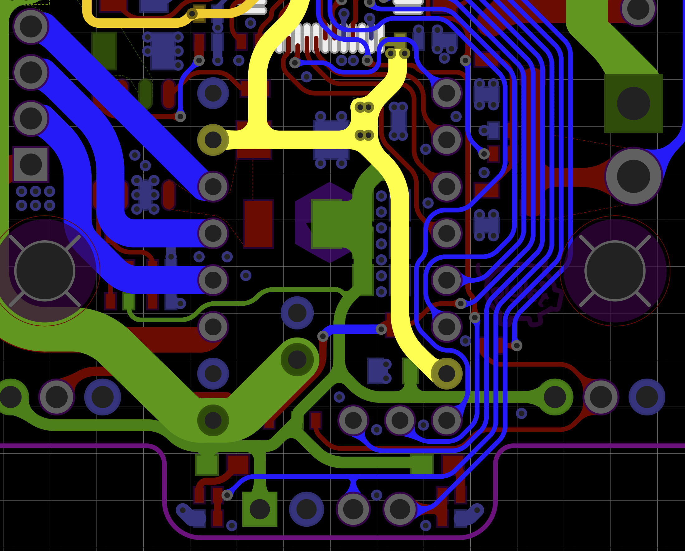
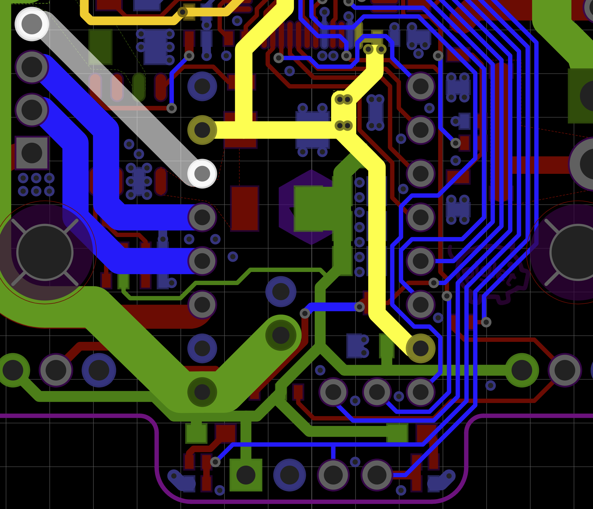

# easyeda-round-tracks

Based on https://github.com/mitxela/kicad-round-tracks this extension applies rounding to the copper traces in an EasyEDA json board file.

Running this script will create this output:

from this input:
 
